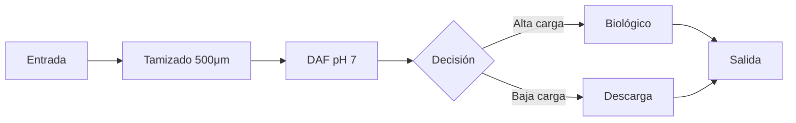

# Plan: Añadir Soporte para Diagramas Mermaid en Deep Advisor

## Resumen

Implementar renderizado de diagramas Mermaid en el chat del Deep Advisor, permitiendo al backend enviar bloques ` ```mermaid ` con diagramas complejos (flowchart, sequence, etc.) que se visualizarán como gráficos interactivos.

---

## Análisis de Opciones

| Opción | Bundle Size | Complejidad | Capacidades |
|--------|-------------|-------------|-------------|
| **Mermaid nativo** | ~500KB | Media | Flowcharts, sequence, gantt, class diagrams, etc. |
| **Formato custom ` ```flow `** | 0KB (ya existe) | Baja | Solo flujos lineales con chips |
| **Híbrido (recomendado)** | ~500KB | Media | Ambos formatos según necesidad |

**Recomendación**: Implementar Mermaid para diagramas complejos, mantener ` ```flow ` para flujos simples (más legibles en móvil).

---

## Cambios a Realizar

### 1. Instalar Dependencia

```bash
npm install mermaid
```

### 2. Crear Componente MermaidRenderer

**Nuevo archivo:** `src/components/advisor/MermaidRenderer.tsx`

```tsx
import { useEffect, useRef, useState } from 'react';
import mermaid from 'mermaid';
import { cn } from '@/lib/utils';

interface MermaidRendererProps {
  content: string;
  className?: string;
}

// Inicializar Mermaid una sola vez
mermaid.initialize({
  startOnLoad: false,
  theme: 'neutral', // o 'dark' para dark mode
  securityLevel: 'loose',
  fontFamily: 'inherit',
});

export function MermaidRenderer({ content, className }: MermaidRendererProps) {
  const containerRef = useRef<HTMLDivElement>(null);
  const [svg, setSvg] = useState<string>('');
  const [error, setError] = useState<string | null>(null);

  useEffect(() => {
    const renderDiagram = async () => {
      if (!content.trim()) return;
      
      try {
        const id = `mermaid-${Math.random().toString(36).substr(2, 9)}`;
        const { svg } = await mermaid.render(id, content);
        setSvg(svg);
        setError(null);
      } catch (err) {
        console.error('Mermaid render error:', err);
        setError('Error al renderizar diagrama');
      }
    };

    renderDiagram();
  }, [content]);

  if (error) {
    return (
      <div className="my-4 p-4 bg-destructive/10 rounded-lg border border-destructive/30">
        <p className="text-sm text-destructive">{error}</p>
        <pre className="mt-2 text-xs text-muted-foreground overflow-x-auto">
          {content}
        </pre>
      </div>
    );
  }

  return (
    <div 
      ref={containerRef}
      className={cn(
        "my-4 p-4 bg-card rounded-lg border border-border overflow-x-auto",
        className
      )}
      dangerouslySetInnerHTML={{ __html: svg }}
    />
  );
}
```

### 3. Actualizar Parsers de Markdown

**Archivos a modificar:**
- `src/components/advisor/AdvisorMessage.tsx`
- `src/components/advisor/streaming/StreamingResponse.tsx`

Añadir detección de bloques ` ```mermaid `:

```tsx
// En el handler de pre:
import { MermaidRenderer } from './MermaidRenderer';

pre: ({ children }) => {
  const codeElement = React.Children.toArray(children).find(
    (child) => React.isValidElement(child) && child.type === 'code'
  );
  
  if (codeElement) {
    const codeClassName = codeElement.props?.className || '';
    const codeContent = String(codeElement.props?.children || '').trim();
    
    // Mermaid diagrams
    if (codeClassName.includes('language-mermaid')) {
      return <MermaidRenderer content={codeContent} />;
    }
    
    // Flow diagrams (formato custom existente)
    if (codeClassName.includes('language-flow')) {
      return <FlowDiagramRenderer content={codeContent} />;
    }
    
    // Chemical equations
    if (codeClassName.includes('language-chem') || 
        codeClassName.includes('language-equation')) {
      return <ChemEquation content={codeContent} />;
    }
  }
  
  return <pre className="...">{children}</pre>;
}
```

### 4. Soporte para Dark Mode (Opcional)

```tsx
// En MermaidRenderer.tsx
import { useTheme } from 'next-themes';

export function MermaidRenderer({ content, className }: MermaidRendererProps) {
  const { theme } = useTheme();
  
  useEffect(() => {
    mermaid.initialize({
      theme: theme === 'dark' ? 'dark' : 'neutral',
      // ...
    });
  }, [theme]);
  
  // ...resto del componente
}
```

---

## Estructura de Archivos

```text
src/components/advisor/
├── AdvisorMessage.tsx          # Modificar: añadir MermaidRenderer
├── FlowDiagramRenderer.tsx     # Sin cambios (formato custom)
├── MermaidRenderer.tsx         # NUEVO: renderizador Mermaid
└── streaming/
    └── StreamingResponse.tsx   # Modificar: añadir MermaidRenderer
```

---

## Convención para el Backend

El backend Railway puede enviar ambos formatos:

**Para diagramas complejos (Mermaid):**
````markdown

````

**Para flujos lineales simples (formato custom):**
````markdown
```flow
Entrada → Tamizado → DAF → Salida
```
````

---

## Tipos de Diagramas Mermaid Soportados

Una vez implementado, el backend podrá enviar:

1. **Flowcharts** - Procesos con bifurcaciones
2. **Sequence diagrams** - Interacciones entre componentes
3. **Gantt charts** - Cronogramas de proyecto
4. **Class diagrams** - Estructuras de datos
5. **State diagrams** - Estados de proceso
6. **Pie charts** - Distribución de datos

---

## Consideraciones Técnicas

### Bundle Size
- Mermaid añade ~500KB al bundle
- Se puede mitigar con lazy loading:
  ```tsx
  const MermaidRenderer = React.lazy(() => import('./MermaidRenderer'));
  ```

### Seguridad
- `securityLevel: 'loose'` permite algunos estilos inline
- El contenido viene del backend controlado, no de usuarios externos

### Rendimiento
- Cada diagrama se renderiza de forma asíncrona
- Los IDs únicos evitan conflictos en múltiples diagramas

---

## Archivos a Modificar

| Archivo | Tipo | Cambio |
|---------|------|--------|
| `package.json` | Modificar | Añadir `mermaid` |
| `src/components/advisor/MermaidRenderer.tsx` | Nuevo | Componente renderizador |
| `src/components/advisor/AdvisorMessage.tsx` | Modificar | Detectar ` ```mermaid ` |
| `src/components/advisor/streaming/StreamingResponse.tsx` | Modificar | Detectar ` ```mermaid ` |
