# Supabase Internal Schema - Vandarum Platform

> **Generado:** 2026-02-03  
> **Total Tablas:** 46  
> **Funciones RPC:** 12  
> **Enums:** 2  
> **Filas Totales (aprox):** ~8,000

---

## Resumen por Módulo

| Módulo | Tablas | Filas Aprox |
|--------|--------|-------------|
| **Advisor (AI Chat)** | advisor_users, advisor_chats, advisor_messages, advisor_credits, advisor_callback_requests | ~165 |
| **Auth/Usuarios** | profiles, user_roles, user_invitations, user_favorites | ~3 |
| **Tecnologías** | technologies, technology_edits, technology_tipos, technology_subcategorias | ~2,581 |
| **Taxonomía** | taxonomy_tipos, taxonomy_subcategorias, taxonomy_sectores | ~154 |
| **Scouting** | scouting_queue, scouting_sessions, scouting_session_logs, scouting_sources, scouting_run_requests | ~1,103 |
| **Estudios** | scouting_studies, study_sessions, study_longlist, study_shortlist, study_evaluations, study_solutions, study_research, study_reports, study_session_logs | ~754 |
| **Casos de Estudio** | casos_de_estudio, case_study_jobs, case_study_technologies | ~102 |
| **Knowledge Base** | knowledge_documents, knowledge_chunks | ~1,301 |
| **Proyectos** | projects, project_technologies | ~128 |
| **Cost Consulting** | cost_consulting_projects, cost_verticals | ~7 |
| **Sistema** | ai_model_settings, ai_usage_logs, audit_logs, sync_queue, technological_trends, rejected_technologies, saved_ai_searches | ~1,899 |

---

## Diagrama de Relaciones (ER)

```mermaid
erDiagram
    %% Módulo Advisor
    advisor_users ||--o{ advisor_chats : "has"
    advisor_users ||--o{ advisor_credits : "has"
    advisor_users ||--o{ advisor_callback_requests : "requests"
    advisor_users ||--o{ cost_consulting_projects : "owns"
    advisor_chats ||--o{ advisor_messages : "contains"

    %% Módulo Auth
    profiles ||--|| user_roles : "has"
    
    %% Módulo Taxonomía
    taxonomy_tipos ||--o{ taxonomy_subcategorias : "contains"
    taxonomy_tipos ||--o{ technology_tipos : "classifies"
    taxonomy_subcategorias ||--o{ technology_subcategorias : "classifies"
    taxonomy_sectores ||--o{ scouting_queue : "categorizes"
    taxonomy_sectores ||--o{ rejected_technologies : "categorizes"
    taxonomy_sectores ||--o{ study_longlist : "categorizes"

    %% Módulo Scouting
    scouting_sessions ||--o{ scouting_session_logs : "logs"
    casos_de_estudio ||--o{ scouting_queue : "sources"

    %% Módulo Estudios
    scouting_studies ||--o{ study_sessions : "has"
    scouting_studies ||--o{ study_longlist : "generates"
    scouting_studies ||--o{ study_shortlist : "refines"
    scouting_studies ||--o{ study_evaluations : "evaluates"
    scouting_studies ||--o{ study_solutions : "proposes"
    scouting_studies ||--o{ study_research : "researches"
    scouting_studies ||--o{ study_reports : "produces"
    study_sessions ||--o{ study_session_logs : "logs"
    study_sessions ||--o{ study_longlist : "generates"
    study_sessions ||--o{ study_research : "finds"
    study_sessions ||--o{ study_evaluations : "evaluates"
    study_longlist ||--o{ study_shortlist : "filters"
    study_shortlist ||--o{ study_evaluations : "evaluates"
    study_solutions ||--o{ study_longlist : "sources"
    study_research ||--o{ study_longlist : "sources"
    knowledge_documents ||--o{ study_research : "references"

    %% Módulo Casos de Estudio
    casos_de_estudio ||--o{ case_study_jobs : "processes"
    casos_de_estudio ||--o{ case_study_technologies : "uses"
    scouting_queue ||--o{ case_study_technologies : "provides"

    %% Módulo Knowledge Base
    knowledge_documents ||--o{ knowledge_chunks : "splits"

    %% Módulo Proyectos
    projects ||--o{ project_technologies : "contains"

    %% Módulo Cost Consulting
    cost_verticals ||--o{ cost_consulting_projects : "categorizes"
```



---

## Enums

### `app_role`
```sql
CREATE TYPE public.app_role AS ENUM (
    'admin',
    'supervisor', 
    'analyst',
    'client_basic',
    'client_professional',
    'client_enterprise'
);
```

### `edit_status`
```sql
CREATE TYPE public.edit_status AS ENUM (
    'pending',
    'approved',
    'rejected'
);
```

---

## Tablas - Detalle Completo

### 1. advisor_callback_requests
**Módulo:** Advisor  
**Filas:** 0  
**Descripción:** Solicitudes de callback comercial de usuarios del Advisor

| Columna | Tipo | Nullable | Default | FK |
|---------|------|----------|---------|-----|
| id | uuid | NO | gen_random_uuid() | PK |
| user_id | uuid | YES | - | advisor_users.id |
| name | text | NO | - | - |
| email | text | NO | - | - |
| company | text | YES | - | - |
| phone | text | YES | - | - |
| preferred_time | text | YES | - | - |
| description | text | YES | - | - |
| notes | text | YES | - | - |
| type | text | YES | 'consultation' | - |
| status | text | YES | 'pending' | - |
| created_at | timestamptz | YES | now() | - |

**RLS:** Public access (ALL)

---

### 2. advisor_chats
**Módulo:** Advisor  
**Filas:** 23  
**Descripción:** Conversaciones del chat AI del Advisor

| Columna | Tipo | Nullable | Default | FK |
|---------|------|----------|---------|-----|
| id | uuid | NO | gen_random_uuid() | PK |
| user_id | uuid | NO | - | advisor_users.id |
| title | text | YES | - | - |
| model_used | text | YES | - | - |
| message_count | integer | YES | - | - |
| total_credits_used | numeric | YES | - | - |
| created_at | timestamptz | YES | now() | - |
| updated_at | timestamptz | YES | now() | - |

---

### 3. advisor_credits
**Módulo:** Advisor  
**Filas:** 47  
**Descripción:** Transacciones de créditos del Advisor

| Columna | Tipo | Nullable | Default | FK |
|---------|------|----------|---------|-----|
| id | uuid | NO | gen_random_uuid() | PK |
| user_id | uuid | NO | - | advisor_users.id |
| amount | numeric | NO | - | - |
| balance_after | numeric | NO | - | - |
| type | text | NO | - | - |
| description | text | YES | - | - |
| model_used | text | YES | - | - |
| stripe_payment_id | text | YES | - | - |
| created_at | timestamptz | YES | now() | - |

---

### 4. advisor_messages
**Módulo:** Advisor  
**Filas:** 94  
**Descripción:** Mensajes individuales en chats del Advisor

| Columna | Tipo | Nullable | Default | FK |
|---------|------|----------|---------|-----|
| id | uuid | NO | gen_random_uuid() | PK |
| chat_id | uuid | NO | - | advisor_chats.id |
| role | text | NO | - | - |
| content | text | NO | - | - |
| sources | jsonb | YES | - | - |
| tokens_input | integer | YES | - | - |
| tokens_output | integer | YES | - | - |
| credits_used | numeric | YES | - | - |
| pdf_url | text | YES | - | - |
| created_at | timestamptz | YES | now() | - |

---

### 5. advisor_users
**Módulo:** Advisor  
**Filas:** 1  
**Descripción:** Usuarios registrados en el sistema Advisor (independiente de auth.users)

| Columna | Tipo | Nullable | Default | FK |
|---------|------|----------|---------|-----|
| id | uuid | NO | gen_random_uuid() | PK |
| email | text | NO | - | UNIQUE |
| password_hash | text | NO | - | - |
| name | text | YES | - | - |
| company | text | YES | - | - |
| sector | text | YES | - | - |
| role | text | YES | - | - |
| credits_balance | numeric | YES | 0 | - |
| free_queries_used | integer | YES | 0 | - |
| free_queries_reset_at | timestamptz | YES | - | - |
| created_at | timestamptz | YES | now() | - |
| updated_at | timestamptz | YES | now() | - |

---

### 6. ai_model_settings
**Módulo:** Sistema  
**Filas:** 4  
**Descripción:** Configuración de modelos AI por tipo de acción

| Columna | Tipo | Nullable | Default | FK |
|---------|------|----------|---------|-----|
| id | text | NO | - | PK |
| action_type | text | NO | - | - |
| model | text | NO | 'google/gemini-2.5-flash' | - |
| updated_by | uuid | YES | - | - |
| updated_at | timestamptz | NO | now() | - |

**RLS:** Admins can manage, authenticated can read

---

### 7. ai_usage_logs
**Módulo:** Sistema  
**Filas:** 118  
**Descripción:** Logs de uso de APIs de AI

| Columna | Tipo | Nullable | Default | FK |
|---------|------|----------|---------|-----|
| id | uuid | NO | gen_random_uuid() | PK |
| user_id | uuid | YES | - | - |
| action_type | text | NO | - | - |
| model | text | NO | - | - |
| input_tokens | integer | YES | 0 | - |
| output_tokens | integer | YES | 0 | - |
| total_tokens | integer | YES | 0 | - |
| response_time_ms | integer | YES | 0 | - |
| success | boolean | YES | true | - |
| error_message | text | YES | - | - |
| created_at | timestamptz | NO | now() | - |

**RLS:** Admins can view, internal users can insert

---

### 8. audit_logs
**Módulo:** Sistema  
**Filas:** 5  
**Descripción:** Registro de auditoría de acciones del sistema

| Columna | Tipo | Nullable | Default | FK |
|---------|------|----------|---------|-----|
| id | uuid | NO | gen_random_uuid() | PK |
| user_id | uuid | YES | - | - |
| action | text | NO | - | - |
| entity_type | text | NO | - | - |
| entity_id | text | YES | - | - |
| details | jsonb | YES | - | - |
| ip_address | text | YES | - | - |
| user_agent | text | YES | - | - |
| created_at | timestamptz | NO | now() | - |

**RLS:** Only admins can view/insert

---

### 9. case_study_jobs
**Módulo:** Casos de Estudio  
**Filas:** 77  
**Descripción:** Jobs de procesamiento de casos de estudio

| Columna | Tipo | Nullable | Default | FK |
|---------|------|----------|---------|-----|
| id | uuid | NO | gen_random_uuid() | PK |
| case_study_id | uuid | YES | - | casos_de_estudio.id |
| status | text | NO | 'pending' | - |
| current_phase | text | YES | - | - |
| progress_percentage | integer | NO | 0 | - |
| technologies_found | integer | YES | - | - |
| technologies_new | integer | YES | - | - |
| documents_count | integer | YES | - | - |
| quality_score | numeric | YES | - | - |
| result_data | jsonb | YES | - | - |
| error_message | text | YES | - | - |
| started_at | timestamptz | YES | - | - |
| completed_at | timestamptz | YES | - | - |
| created_at | timestamptz | NO | now() | - |
| updated_at | timestamptz | NO | now() | - |

---

### 10. case_study_technologies
**Módulo:** Casos de Estudio  
**Filas:** 22  
**Descripción:** Tecnologías asociadas a casos de estudio

| Columna | Tipo | Nullable | Default | FK |
|---------|------|----------|---------|-----|
| id | uuid | NO | gen_random_uuid() | PK |
| case_study_id | uuid | NO | - | casos_de_estudio.id |
| technology_id | uuid | YES | - | - |
| scouting_queue_id | uuid | YES | - | scouting_queue.id |
| technology_name | text | NO | - | - |
| provider | text | YES | - | - |
| role | text | NO | - | - |
| selection_rationale | text | YES | - | - |
| economic_analysis | jsonb | YES | '{}' | - |
| application_data | jsonb | YES | - | - |
| created_at | timestamptz | NO | now() | - |

**RLS:** Anyone can read, internal users can insert/update, admins can delete

---

### 11. casos_de_estudio
**Módulo:** Casos de Estudio  
**Filas:** 3  
**Descripción:** Casos de estudio de implementación de tecnologías

| Columna | Tipo | Nullable | Default | FK |
|---------|------|----------|---------|-----|
| id | uuid | NO | gen_random_uuid() | PK |
| name | text | NO | - | - |
| description | text | YES | - | - |
| entity_type | text | YES | - | - |
| country | text | YES | - | - |
| sector | text | YES | - | - |
| technology_types | text[] | YES | - | - |
| treatment_train | text[] | YES | '{}' | - |
| solution_applied | text | YES | - | - |
| results_achieved | text | YES | - | - |
| problem_parameters | jsonb | YES | '{}' | - |
| results_parameters | jsonb | YES | '{}' | - |
| roi_percent | numeric | YES | - | - |
| roi_rationale | text | YES | - | - |
| capex | numeric | YES | - | - |
| opex_year | numeric | YES | - | - |
| payback_months | integer | YES | - | - |
| lessons_learned | text | YES | - | - |
| quality_score | integer | YES | - | - |
| source_folder | text | YES | - | - |
| source_documents | jsonb | YES | '[]' | - |
| source_technology_id | uuid | YES | - | - |
| original_data | jsonb | YES | - | - |
| status | text | YES | 'draft' | - |
| created_by | uuid | YES | - | - |
| created_at | timestamptz | YES | now() | - |
| updated_at | timestamptz | YES | now() | - |

**RLS:** Anyone can read, internal users can insert/update, admins can delete

---

### 12. cost_consulting_projects
**Módulo:** Cost Consulting  
**Filas:** 0  
**Descripción:** Proyectos de consultoría de optimización de costos

| Columna | Tipo | Nullable | Default | FK |
|---------|------|----------|---------|-----|
| id | uuid | NO | gen_random_uuid() | PK |
| user_id | uuid | NO | - | advisor_users.id |
| vertical_id | uuid | YES | - | cost_verticals.id |
| name | text | NO | - | - |
| client_name | text | YES | - | - |
| status | text | NO | 'draft' | - |
| notes | text | YES | - | - |
| total_spend_analyzed | numeric | YES | 0 | - |
| total_savings_identified | numeric | YES | 0 | - |
| opportunities_count | integer | YES | 0 | - |
| contracts_count | integer | YES | 0 | - |
| invoices_count | integer | YES | 0 | - |
| created_at | timestamptz | YES | now() | - |
| updated_at | timestamptz | YES | now() | - |

**RLS:** Users can CRUD their own projects

---

### 13. cost_verticals
**Módulo:** Cost Consulting  
**Filas:** 7  
**Descripción:** Verticales/categorías de costos (energía, agua, residuos, etc.)

| Columna | Tipo | Nullable | Default | FK |
|---------|------|----------|---------|-----|
| id | uuid | NO | gen_random_uuid() | PK |
| name | text | NO | - | - |
| icon | text | YES | - | - |
| description | text | YES | - | - |
| created_at | timestamptz | YES | now() | - |

**RLS:** Anyone can read (read-only table)

---

### 14. knowledge_chunks
**Módulo:** Knowledge Base  
**Filas:** 386  
**Descripción:** Chunks de documentos para búsqueda semántica

| Columna | Tipo | Nullable | Default | FK |
|---------|------|----------|---------|-----|
| id | uuid | NO | gen_random_uuid() | PK |
| document_id | uuid | NO | - | knowledge_documents.id |
| chunk_index | integer | NO | - | - |
| content | text | NO | - | - |
| tokens | integer | YES | - | - |
| created_at | timestamptz | NO | now() | - |

---

### 15. knowledge_documents
**Módulo:** Knowledge Base  
**Filas:** 915  
**Descripción:** Documentos de la base de conocimiento

| Columna | Tipo | Nullable | Default | FK |
|---------|------|----------|---------|-----|
| id | uuid | NO | gen_random_uuid() | PK |
| name | text | NO | - | - |
| description | text | YES | - | - |
| file_path | text | NO | - | - |
| file_size | integer | YES | - | - |
| mime_type | text | YES | - | - |
| category | text | YES | - | - |
| sector | text | YES | - | - |
| status | text | NO | 'pending' | - |
| chunk_count | integer | YES | - | - |
| uploaded_by | uuid | YES | - | - |
| created_at | timestamptz | NO | now() | - |
| updated_at | timestamptz | NO | now() | - |

---

### 16. profiles
**Módulo:** Auth/Usuarios  
**Filas:** 1  
**Descripción:** Perfiles de usuarios de la plataforma interna

| Columna | Tipo | Nullable | Default | FK |
|---------|------|----------|---------|-----|
| id | uuid | NO | gen_random_uuid() | PK |
| user_id | uuid | NO | - | auth.users.id |
| full_name | text | YES | - | - |
| role | app_role | NO | 'client_basic' | - |
| created_at | timestamptz | NO | now() | - |
| updated_at | timestamptz | NO | now() | - |

---

### 17. project_technologies
**Módulo:** Proyectos  
**Filas:** 125  
**Descripción:** Relación many-to-many entre proyectos y tecnologías

| Columna | Tipo | Nullable | Default | FK |
|---------|------|----------|---------|-----|
| id | uuid | NO | gen_random_uuid() | PK |
| project_id | uuid | NO | - | projects.id |
| technology_id | uuid | NO | - | - |
| added_by | uuid | YES | - | - |
| added_at | timestamptz | NO | now() | - |

---

### 18. projects
**Módulo:** Proyectos  
**Filas:** 3  
**Descripción:** Proyectos de clientes

| Columna | Tipo | Nullable | Default | FK |
|---------|------|----------|---------|-----|
| id | uuid | NO | gen_random_uuid() | PK |
| name | text | NO | - | - |
| description | text | YES | - | - |
| client_id | uuid | YES | - | - |
| responsible_user_id | uuid | YES | - | - |
| status | text | YES | 'pending' | - |
| target_date | date | YES | - | - |
| notes | text | YES | - | - |
| created_by | uuid | YES | - | - |
| created_at | timestamptz | NO | now() | - |
| updated_at | timestamptz | NO | now() | - |

---

### 19. rejected_technologies
**Módulo:** Sistema  
**Filas:** 0  
**Descripción:** Tecnologías rechazadas del scouting queue

| Columna | Tipo | Nullable | Default | FK |
|---------|------|----------|---------|-----|
| id | uuid | NO | gen_random_uuid() | PK |
| original_scouting_id | uuid | YES | - | - |
| Nombre de la tecnología | text | NO | - | - |
| Tipo de tecnología | text | NO | 'Sin clasificar' | - |
| Subcategoría | text | YES | - | - |
| Proveedor / Empresa | text | YES | - | - |
| País de origen | text | YES | - | - |
| Descripción técnica breve | text | YES | - | - |
| Grado de madurez (TRL) | integer | YES | - | - |
| tipo_id | integer | YES | - | taxonomy_tipos.id |
| subcategoria_id | integer | YES | - | taxonomy_subcategorias.id |
| sector_id | varchar | YES | - | taxonomy_sectores.id |
| rejection_reason | text | NO | - | - |
| rejection_category | text | YES | - | - |
| rejected_by | uuid | YES | - | - |
| rejected_at | timestamptz | NO | now() | - |
| original_data | jsonb | YES | - | - |
| created_at | timestamptz | NO | now() | - |

---

### 20. saved_ai_searches
**Módulo:** Sistema  
**Filas:** 0  
**Descripción:** Búsquedas AI guardadas por usuarios

| Columna | Tipo | Nullable | Default | FK |
|---------|------|----------|---------|-----|
| id | uuid | NO | gen_random_uuid() | PK |
| user_id | uuid | NO | - | - |
| name | text | NO | - | - |
| query | text | NO | - | - |
| filters | jsonb | YES | '{}' | - |
| created_at | timestamptz | NO | now() | - |
| updated_at | timestamptz | NO | now() | - |

**RLS:** Users can CRUD their own searches

---

### 21. scouting_queue
**Módulo:** Scouting  
**Filas:** 149  
**Descripción:** Cola de tecnologías pendientes de revisión

| Columna | Tipo | Nullable | Default | FK |
|---------|------|----------|---------|-----|
| id | uuid | NO | gen_random_uuid() | PK |
| Nombre de la tecnología | text | NO | - | - |
| Tipo de tecnología | text | NO | 'Sin clasificar' | - |
| Subcategoría | text | YES | - | - |
| Sector y subsector | text | YES | - | - |
| Proveedor / Empresa | text | YES | - | - |
| País de origen | text | YES | - | - |
| Paises donde actua | text | YES | - | - |
| Web de la empresa | text | YES | - | - |
| Email de contacto | text | YES | - | - |
| Descripción técnica breve | text | YES | - | - |
| Aplicación principal | text | YES | - | - |
| Ventaja competitiva clave | text | YES | - | - |
| Porque es innovadora | text | YES | - | - |
| Casos de referencia | text | YES | - | - |
| Comentarios del analista | text | YES | - | - |
| Estado del seguimiento | text | YES | - | - |
| Grado de madurez (TRL) | integer | YES | - | - |
| Fecha de scouting | date | YES | CURRENT_DATE | - |
| tipo_id | integer | YES | - | taxonomy_tipos.id |
| subcategoria_id | integer | YES | - | taxonomy_subcategorias.id |
| sector_id | varchar | YES | - | taxonomy_sectores.id |
| subsector_industrial | varchar | YES | - | - |
| source | text | YES | 'manual' | - |
| source_url | text | YES | - | - |
| scouting_job_id | text | YES | - | - |
| priority | text | YES | 'normal' | - |
| notes | text | YES | - | - |
| queue_status | text | YES | 'pending' | - |
| rejection_reason | text | YES | - | - |
| case_study_id | uuid | YES | - | casos_de_estudio.id |
| created_by | uuid | YES | - | - |
| reviewed_by | uuid | YES | - | - |
| reviewed_at | timestamptz | YES | - | - |
| created_at | timestamptz | NO | now() | - |
| updated_at | timestamptz | NO | now() | - |

**RLS:** Internal users can view/insert/update, admins/supervisors can delete

---

### 22. scouting_run_requests
**Módulo:** Scouting  
**Filas:** 14  
**Descripción:** Solicitudes de ejecución de scouting

| Columna | Tipo | Nullable | Default | FK |
|---------|------|----------|---------|-----|
| id | uuid | NO | gen_random_uuid() | PK |
| request_id | uuid | NO | - | - |
| user_id | uuid | NO | - | - |
| job_id | text | YES | - | - |
| payload_hash | text | YES | - | - |
| status | text | NO | 'pending' | - |
| created_at | timestamptz | NO | now() | - |
| expires_at | timestamptz | NO | now() + 1 hour | - |

**RLS:** Users can view/insert/update their own requests

---

### 23. scouting_session_logs
**Módulo:** Scouting  
**Filas:** 703  
**Descripción:** Logs de sesiones de scouting

| Columna | Tipo | Nullable | Default | FK |
|---------|------|----------|---------|-----|
| id | uuid | NO | gen_random_uuid() | PK |
| session_id | text | NO | - | scouting_sessions.session_id |
| level | text | NO | 'info' | - |
| phase | text | YES | - | - |
| message | text | NO | - | - |
| details | jsonb | YES | - | - |
| timestamp | timestamptz | NO | now() | - |
| created_at | timestamptz | NO | now() | - |

**RLS:** Admins/supervisors/analysts can view

---

### 24. scouting_sessions
**Módulo:** Scouting  
**Filas:** 27  
**Descripción:** Sesiones de scouting automatizado

| Columna | Tipo | Nullable | Default | FK |
|---------|------|----------|---------|-----|
| id | uuid | NO | gen_random_uuid() | PK |
| session_id | text | NO | - | UNIQUE |
| status | text | NO | 'running' | - |
| current_phase | text | YES | - | - |
| current_activity | text | YES | - | - |
| current_site | text | YES | - | - |
| progress_percentage | integer | YES | 0 | - |
| sites_examined | integer | YES | 0 | - |
| technologies_found | integer | YES | 0 | - |
| technologies_discarded | integer | YES | 0 | - |
| technologies_approved | integer | YES | 0 | - |
| config | jsonb | YES | - | - |
| summary | jsonb | YES | - | - |
| phase_details | jsonb | YES | '{}' | - |
| activity_timeline | jsonb | YES | '[]' | - |
| error_message | text | YES | - | - |
| last_heartbeat | timestamptz | YES | now() | - |
| started_at | timestamptz | NO | now() | - |
| completed_at | timestamptz | YES | - | - |
| created_at | timestamptz | NO | now() | - |
| updated_at | timestamptz | NO | now() | - |

**RLS:** Admins/supervisors/analysts can view, authenticated can insert/update

---

### 25. scouting_sources
**Módulo:** Scouting  
**Filas:** 210  
**Descripción:** Fuentes de scouting tecnológico

| Columna | Tipo | Nullable | Default | FK |
|---------|------|----------|---------|-----|
| id | uuid | NO | gen_random_uuid() | PK |
| nombre | text | NO | - | - |
| url | text | NO | - | - |
| tipo | text | YES | - | - |
| descripcion | text | YES | - | - |
| pais | text | YES | - | - |
| sector_foco | text | YES | - | - |
| tecnologias_foco | text | YES | - | - |
| frecuencia_escaneo | text | YES | - | - |
| ultima_revision | timestamptz | YES | - | - |
| proxima_revision | timestamptz | YES | - | - |
| tecnologias_encontradas | integer | YES | 0 | - |
| calidad_score | integer | YES | - | - |
| activo | boolean | YES | true | - |
| notas | text | YES | - | - |
| created_by | uuid | YES | - | - |
| created_at | timestamptz | NO | now() | - |
| updated_at | timestamptz | NO | now() | - |

**RLS:** Internal users can view/insert/update, admins can delete

---

### 26. scouting_studies
**Módulo:** Estudios  
**Filas:** 1  
**Descripción:** Estudios de scouting tecnológico

| Columna | Tipo | Nullable | Default | FK |
|---------|------|----------|---------|-----|
| id | uuid | NO | gen_random_uuid() | PK |
| name | text | NO | - | - |
| description | text | YES | - | - |
| problem_statement | text | YES | - | - |
| context | text | YES | - | - |
| objectives | text[] | YES | - | - |
| constraints | text[] | YES | - | - |
| status | text | NO | 'draft' | - |
| current_phase | integer | NO | 1 | - |
| ai_session_id | uuid | YES | - | study_sessions.id |
| assigned_to | uuid | YES | - | - |
| created_by | uuid | YES | - | - |
| started_at | timestamptz | YES | - | - |
| completed_at | timestamptz | YES | - | - |
| created_at | timestamptz | NO | now() | - |
| updated_at | timestamptz | NO | now() | - |

**RLS:** Authenticated users can CRUD

---

### 27. study_evaluations
**Módulo:** Estudios  
**Filas:** 10  
**Descripción:** Evaluaciones detalladas de tecnologías en shortlist

| Columna | Tipo | Nullable | Default | FK |
|---------|------|----------|---------|-----|
| id | uuid | NO | gen_random_uuid() | PK |
| study_id | uuid | NO | - | scouting_studies.id |
| shortlist_id | uuid | NO | - | study_shortlist.id |
| session_id | uuid | YES | - | study_sessions.id |
| overall_score | numeric | YES | - | - |
| trl_score | numeric | YES | - | - |
| cost_score | numeric | YES | - | - |
| scalability_score | numeric | YES | - | - |
| context_fit_score | numeric | YES | - | - |
| innovation_potential_score | numeric | YES | - | - |
| strengths | text[] | YES | - | - |
| weaknesses | text[] | YES | - | - |
| opportunities | text[] | YES | - | - |
| threats | text[] | YES | - | - |
| competitive_advantages | text[] | YES | - | - |
| competitive_disadvantages | text[] | YES | - | - |
| implementation_barriers | text[] | YES | - | - |
| requirements_met | text[] | YES | - | - |
| requirements_unmet | text[] | YES | - | - |
| recommendation | text | YES | - | - |
| market_position | text | YES | - | - |
| ai_generated | boolean | NO | false | - |
| ai_scores | jsonb | YES | - | - |
| ai_swot | jsonb | YES | - | - |
| ai_recommendation | text | YES | - | - |
| ai_analysis_json | jsonb | YES | - | - |
| ai_external_data | jsonb | YES | - | - |
| ai_kb_insights | jsonb | YES | - | - |
| ai_analyzed_at | timestamptz | YES | - | - |
| evaluated_by | uuid | YES | - | - |
| evaluated_at | timestamptz | NO | now() | - |
| (+ notes columns) | text | YES | - | - |

---

### 28. study_longlist
**Módulo:** Estudios  
**Filas:** 31  
**Descripción:** Lista larga de tecnologías candidatas

| Columna | Tipo | Nullable | Default | FK |
|---------|------|----------|---------|-----|
| id | uuid | NO | gen_random_uuid() | PK |
| study_id | uuid | NO | - | scouting_studies.id |
| session_id | uuid | YES | - | study_sessions.id |
| solution_id | uuid | YES | - | study_solutions.id |
| source_research_id | uuid | YES | - | study_research.id |
| technology_id | uuid | YES | - | - |
| existing_technology_id | uuid | YES | - | - |
| technology_name | text | NO | - | - |
| provider | text | YES | - | - |
| country | text | YES | - | - |
| web | text | YES | - | - |
| email | text | YES | - | - |
| brief_description | text | YES | - | - |
| trl | integer | YES | - | - |
| tipo_id | integer | YES | - | taxonomy_tipos.id |
| subcategoria_id | integer | YES | - | taxonomy_subcategorias.id |
| sector_id | varchar | YES | - | taxonomy_sectores.id |
| subsector_industrial | text | YES | - | - |
| type_suggested | text | YES | - | - |
| subcategory_suggested | text | YES | - | - |
| applications | text[] | YES | - | - |
| sector | text | YES | - | - |
| paises_actua | text | YES | - | - |
| ventaja_competitiva | text | YES | - | - |
| innovacion | text | YES | - | - |
| casos_referencia | text | YES | - | - |
| inclusion_reason | text | YES | - | - |
| source | text | YES | - | - |
| confidence_score | numeric | YES | 0.8 | - |
| already_in_db | boolean | YES | false | - |
| status | text | YES | 'active' | - |
| added_by | uuid | YES | - | - |
| added_at | timestamptz | NO | now() | - |

**RLS:** Authenticated users can manage

---

### 29. study_reports
**Módulo:** Estudios  
**Filas:** 7  
**Descripción:** Informes generados de estudios

| Columna | Tipo | Nullable | Default | FK |
|---------|------|----------|---------|-----|
| id | uuid | NO | gen_random_uuid() | PK |
| study_id | uuid | NO | - | scouting_studies.id |
| title | text | NO | - | - |
| version | integer | NO | 1 | - |
| executive_summary | text | YES | - | - |
| methodology | text | YES | - | - |
| problem_analysis | text | YES | - | - |
| solutions_overview | text | YES | - | - |
| technology_comparison | text | YES | - | - |
| recommendations | text | YES | - | - |
| conclusions | text | YES | - | - |
| appendices | jsonb | YES | - | - |
| generated_by | text | YES | 'manual' | - |
| file_path | text | YES | - | - |
| created_by | uuid | YES | - | - |
| created_at | timestamptz | NO | now() | - |

**RLS:** Authenticated users can manage

---

### 30. study_research
**Módulo:** Estudios  
**Filas:** 40  
**Descripción:** Investigación y fuentes de estudios

| Columna | Tipo | Nullable | Default | FK |
|---------|------|----------|---------|-----|
| id | uuid | NO | gen_random_uuid() | PK |
| study_id | uuid | NO | - | scouting_studies.id |
| session_id | uuid | YES | - | study_sessions.id |
| knowledge_doc_id | uuid | YES | - | knowledge_documents.id |
| title | text | NO | - | - |
| source_type | text | YES | - | - |
| source_url | text | YES | - | - |
| authors | text | YES | - | - |
| publication_date | date | YES | - | - |
| summary | text | YES | - | - |
| key_findings | text[] | YES | - | - |
| technology_mentioned | text | YES | - | - |
| provider_mentioned | text | YES | - | - |
| relevance_score | integer | YES | - | - |
| ai_generated | boolean | NO | false | - |
| ai_extracted | boolean | YES | false | - |
| created_by | uuid | YES | - | - |
| created_at | timestamptz | NO | now() | - |

**RLS:** Authenticated users can manage

---

### 31. study_session_logs
**Módulo:** Estudios  
**Filas:** 578  
**Descripción:** Logs de sesiones de estudio

| Columna | Tipo | Nullable | Default | FK |
|---------|------|----------|---------|-----|
| id | uuid | NO | gen_random_uuid() | PK |
| session_id | uuid | NO | - | study_sessions.id |
| study_id | uuid | NO | - | scouting_studies.id |
| level | text | NO | 'info' | - |
| phase | text | YES | - | - |
| message | text | NO | - | - |
| details | jsonb | YES | - | - |
| created_at | timestamptz | NO | now() | - |

**RLS:** Service role full access, users can view/insert

---

### 32. study_sessions
**Módulo:** Estudios  
**Filas:** 62  
**Descripción:** Sesiones de procesamiento de estudios

| Columna | Tipo | Nullable | Default | FK |
|---------|------|----------|---------|-----|
| id | uuid | NO | gen_random_uuid() | PK |
| study_id | uuid | NO | - | scouting_studies.id |
| session_type | text | NO | - | - |
| status | text | NO | 'pending' | - |
| current_phase | text | YES | - | - |
| progress_percentage | integer | YES | 0 | - |
| config | jsonb | YES | - | - |
| summary | jsonb | YES | - | - |
| error_message | text | YES | - | - |
| started_at | timestamptz | YES | - | - |
| completed_at | timestamptz | YES | - | - |
| created_at | timestamptz | NO | now() | - |
| updated_at | timestamptz | NO | now() | - |

**RLS:** Service role full access, users can view/insert/update

---

### 33. study_shortlist
**Módulo:** Estudios  
**Filas:** 10  
**Descripción:** Lista corta de tecnologías seleccionadas

| Columna | Tipo | Nullable | Default | FK |
|---------|------|----------|---------|-----|
| id | uuid | NO | gen_random_uuid() | PK |
| study_id | uuid | NO | - | scouting_studies.id |
| longlist_id | uuid | NO | - | study_longlist.id |
| priority | integer | YES | - | - |
| selection_reason | text | YES | - | - |
| notes | text | YES | - | - |
| selected_by | uuid | YES | - | - |
| selected_at | timestamptz | NO | now() | - |

---

### 34. study_solutions
**Módulo:** Estudios  
**Filas:** 15  
**Descripción:** Soluciones/enfoques tecnológicos identificados

| Columna | Tipo | Nullable | Default | FK |
|---------|------|----------|---------|-----|
| id | uuid | NO | gen_random_uuid() | PK |
| study_id | uuid | NO | - | scouting_studies.id |
| category | text | NO | - | - |
| name | text | NO | - | - |
| description | text | YES | - | - |
| priority | integer | YES | 0 | - |
| advantages | text[] | YES | - | - |
| disadvantages | text[] | YES | - | - |
| applicable_contexts | text[] | YES | - | - |
| applicable_sectors | text[] | YES | - | - |
| estimated_trl_range | text | YES | - | - |
| cost_range | text | YES | - | - |
| implementation_time | text | YES | - | - |
| key_providers | text[] | YES | - | - |
| case_studies | text[] | YES | - | - |
| source_url | text | YES | - | - |
| source_title | text | YES | - | - |
| detailed_info | text | YES | - | - |
| created_by | uuid | YES | - | - |
| created_at | timestamptz | NO | now() | - |

**RLS:** Authenticated users can manage

---

### 35. sync_queue
**Módulo:** Sistema  
**Filas:** 1,774  
**Descripción:** Cola de sincronización con base de datos externa

| Columna | Tipo | Nullable | Default | FK |
|---------|------|----------|---------|-----|
| id | uuid | NO | gen_random_uuid() | PK |
| table_name | text | NO | - | - |
| record_id | uuid | NO | - | - |
| operation | text | NO | - | - |
| payload | jsonb | NO | - | - |
| status | text | YES | 'pending' | - |
| attempts | integer | YES | 0 | - |
| max_attempts | integer | YES | 5 | - |
| last_error | text | YES | - | - |
| next_retry_at | timestamptz | YES | now() | - |
| processed_at | timestamptz | YES | - | - |
| created_at | timestamptz | YES | now() | - |

**RLS:** Service role full access

---

### 36. taxonomy_sectores
**Módulo:** Taxonomía  
**Filas:** 3  
**Descripción:** Sectores industriales

| Columna | Tipo | Nullable | Default | FK |
|---------|------|----------|---------|-----|
| id | varchar | NO | - | PK |
| nombre | varchar | NO | - | - |
| descripcion | text | YES | - | - |

**RLS:** Anyone can read, admins can manage

---

### 37. taxonomy_subcategorias
**Módulo:** Taxonomía  
**Filas:** 142  
**Descripción:** Subcategorías de tipos de tecnología

| Columna | Tipo | Nullable | Default | FK |
|---------|------|----------|---------|-----|
| id | integer | NO | auto_increment | PK |
| tipo_id | integer | YES | - | taxonomy_tipos.id |
| codigo | varchar | NO | - | - |
| nombre | varchar | NO | - | - |

**RLS:** Anyone can read, admins can manage

---

### 38. taxonomy_tipos
**Módulo:** Taxonomía  
**Filas:** 9  
**Descripción:** Tipos principales de tecnología

| Columna | Tipo | Nullable | Default | FK |
|---------|------|----------|---------|-----|
| id | integer | NO | auto_increment | PK |
| codigo | varchar | NO | - | - |
| nombre | varchar | NO | - | - |
| descripcion | text | YES | - | - |

**RLS:** Anyone can read, admins can manage

---

### 39. technological_trends
**Módulo:** Sistema  
**Filas:** 2  
**Descripción:** Tendencias tecnológicas identificadas

| Columna | Tipo | Nullable | Default | FK |
|---------|------|----------|---------|-----|
| id | uuid | NO | gen_random_uuid() | PK |
| name | text | NO | - | - |
| description | text | YES | - | - |
| category | text | YES | - | - |
| impact_level | text | YES | - | - |
| timeframe | text | YES | - | - |
| sources | jsonb | YES | - | - |
| related_technologies | uuid[] | YES | - | - |
| created_by | uuid | YES | - | - |
| created_at | timestamptz | NO | now() | - |
| updated_at | timestamptz | NO | now() | - |

---

### 40. technologies
**Módulo:** Tecnologías  
**Filas:** 2,551  
**Descripción:** Tabla principal de tecnologías

| Columna | Tipo | Nullable | Default | FK |
|---------|------|----------|---------|-----|
| id | uuid | NO | gen_random_uuid() | PK |
| nombre | text | NO | - | - |
| descripcion | text | YES | - | - |
| proveedor | text | YES | - | - |
| pais | text | YES | - | - |
| web | text | YES | - | - |
| email | text | YES | - | - |
| tipo | text | YES | - | - |
| sector | text | YES | - | - |
| aplicacion | text | YES | - | - |
| ventaja | text | YES | - | - |
| innovacion | text | YES | - | - |
| casos_referencia | text | YES | - | - |
| paises_actua | text | YES | - | - |
| comentarios | text | YES | - | - |
| fecha_scouting | date | YES | - | - |
| estado_seguimiento | text | YES | - | - |
| trl | integer | YES | - | - |
| categorias | text[] | YES | - | - |
| tipos | text[] | YES | - | - |
| subcategorias | text[] | YES | - | - |
| tipo_id | integer | YES | - | - |
| subcategoria_id | integer | YES | - | - |
| sector_id | varchar | YES | - | - |
| subsector_industrial | text | YES | - | - |
| status | text | YES | - | - |
| quality_score | numeric | YES | - | - |
| review_status | text | YES | - | - |
| reviewer_id | uuid | YES | - | - |
| review_requested_at | timestamptz | YES | - | - |
| review_requested_by | uuid | YES | - | - |
| reviewed_at | timestamptz | YES | - | - |
| embedding | vector | YES | - | - |
| created_by | uuid | YES | - | - |
| updated_by | uuid | YES | - | - |
| created_at | timestamptz | NO | now() | - |
| updated_at | timestamptz | NO | now() | - |

---

### 41. technology_edits
**Módulo:** Tecnologías  
**Filas:** 0  
**Descripción:** Ediciones pendientes de aprobación

| Columna | Tipo | Nullable | Default | FK |
|---------|------|----------|---------|-----|
| id | uuid | NO | gen_random_uuid() | PK |
| technology_id | uuid | YES | - | - |
| edit_type | text | YES | 'update' | - |
| proposed_changes | jsonb | NO | - | - |
| original_data | jsonb | YES | - | - |
| status | edit_status | NO | 'pending' | - |
| comments | text | YES | - | - |
| review_comments | text | YES | - | - |
| created_by | uuid | NO | - | - |
| reviewed_by | uuid | YES | - | - |
| reviewed_at | timestamptz | YES | - | - |
| created_at | timestamptz | NO | now() | - |

**RLS:** Internal users can create, supervisors/admins can update/view all

---

### 42. technology_subcategorias
**Módulo:** Tecnologías  
**Filas:** 11  
**Descripción:** Relación many-to-many tecnologías-subcategorías

| Columna | Tipo | Nullable | Default | FK |
|---------|------|----------|---------|-----|
| id | uuid | NO | gen_random_uuid() | PK |
| technology_id | uuid | NO | - | - |
| subcategoria_id | integer | NO | - | taxonomy_subcategorias.id |
| is_primary | boolean | YES | false | - |
| created_at | timestamptz | YES | now() | - |

**RLS:** Anyone can read, internal users can CRUD

---

### 43. technology_tipos
**Módulo:** Tecnologías  
**Filas:** 19  
**Descripción:** Relación many-to-many tecnologías-tipos

| Columna | Tipo | Nullable | Default | FK |
|---------|------|----------|---------|-----|
| id | uuid | NO | gen_random_uuid() | PK |
| technology_id | uuid | NO | - | - |
| tipo_id | integer | NO | - | taxonomy_tipos.id |
| is_primary | boolean | YES | false | - |
| created_at | timestamptz | YES | now() | - |

**RLS:** Anyone can read, internal users can CRUD

---

### 44. user_favorites
**Módulo:** Auth/Usuarios  
**Filas:** 0  
**Descripción:** Tecnologías favoritas de usuarios

| Columna | Tipo | Nullable | Default | FK |
|---------|------|----------|---------|-----|
| id | uuid | NO | gen_random_uuid() | PK |
| user_id | uuid | NO | - | - |
| technology_id | uuid | NO | - | - |
| created_at | timestamptz | NO | now() | - |

**RLS:** Users can view/add/remove their own favorites

---

### 45. user_invitations
**Módulo:** Auth/Usuarios  
**Filas:** 0  
**Descripción:** Invitaciones pendientes de usuarios

| Columna | Tipo | Nullable | Default | FK |
|---------|------|----------|---------|-----|
| id | uuid | NO | gen_random_uuid() | PK |
| email | text | NO | - | - |
| role | text | NO | 'client_basic' | - |
| status | text | NO | 'pending' | - |
| invited_by | uuid | YES | - | - |
| expires_at | timestamptz | NO | now() + 7 days | - |
| accepted_at | timestamptz | YES | - | - |
| created_at | timestamptz | NO | now() | - |

**RLS:** Admins can manage

---

### 46. user_roles
**Módulo:** Auth/Usuarios  
**Filas:** 1  
**Descripción:** Roles asignados a usuarios

| Columna | Tipo | Nullable | Default | FK |
|---------|------|----------|---------|-----|
| id | uuid | NO | gen_random_uuid() | PK |
| user_id | uuid | NO | - | - |
| role | app_role | NO | - | - |

**RLS:** Users can view own, admins can manage all

---

## Funciones RPC

### 1. `has_role(_user_id uuid, _role app_role)`
**Returns:** boolean  
**Descripción:** Verifica si un usuario tiene un rol específico. Usada en RLS policies.

### 2. `approve_scouting_to_technologies(scouting_id uuid)`
**Returns:** uuid  
**Descripción:** Aprueba una tecnología del scouting_queue y la mueve a la tabla technologies principal.

### 3. `reject_scouting_to_rejected(scouting_id uuid, reason text, category text)`
**Returns:** uuid  
**Descripción:** Rechaza una tecnología del scouting_queue y la mueve a rejected_technologies.

### 4. `check_scouting_duplicate(p_name text, p_provider text)`
**Returns:** TABLE(id uuid, name text, provider text, similarity numeric)  
**Descripción:** Verifica duplicados en scouting_queue por nombre y proveedor.

### 5. `check_technology_duplicate(p_name text, p_provider text)`
**Returns:** TABLE(id uuid, name text, provider text, similarity numeric)  
**Descripción:** Verifica duplicados en technologies por nombre y proveedor.

### 6. `close_zombie_jobs(max_age_minutes integer)`
**Returns:** integer  
**Descripción:** Cierra jobs de scouting que han estado activos más tiempo del permitido.

### 7. `close_zombie_case_study_jobs(max_age_minutes integer)`
**Returns:** integer  
**Descripción:** Cierra jobs de case study que han estado activos más tiempo del permitido.

### 8. `force_close_scouting_job(job_id text, close_reason text)`
**Returns:** boolean  
**Descripción:** Fuerza el cierre de un job de scouting específico.

### 9. `deduct_advisor_credits(p_user_id uuid, p_amount numeric, p_model text, p_description text)`
**Returns:** json  
**Descripción:** Deduce créditos de un usuario del Advisor y registra la transacción.

### 10. `normalize_source_url(url text)`
**Returns:** text  
**Descripción:** Normaliza URLs de fuentes eliminando parámetros y trailing slashes.

### 11. `normalize_tech_name(input_text text)`
**Returns:** text  
**Descripción:** Normaliza nombres de tecnologías para comparación.

### 12. `search_technologies_by_keywords(p_keywords text[], p_min_trl integer, p_max_results integer)`
**Returns:** TABLE(...)  
**Descripción:** Búsqueda de tecnologías por keywords con filtro TRL básico.

### 13. `search_technologies_by_keywords_v2(p_keywords text[], ...filters)`
**Returns:** TABLE(...)  
**Descripción:** Búsqueda avanzada de tecnologías con múltiples filtros (tipo, subcategoría, sector, país, etc.).

---

## Notas de Seguridad

### Warnings Detectados (19 issues)

1. **RLS Policies Permisivas:**
   - `advisor_callback_requests`: Public access total
   - `study_session_logs`, `study_sessions`: `USING (true)` muy permisivo
   - `sync_queue`: Service role full access sin restricciones

2. **Tablas sin políticas de DELETE:**
   - `scouting_session_logs`
   - `scouting_sessions`
   - `scouting_run_requests`
   - `ai_usage_logs`
   - `audit_logs`
   - `saved_ai_searches`
   - `technology_edits`

3. **Recomendaciones:**
   - Revisar políticas de `advisor_callback_requests` - considera restringir a usuarios autenticados
   - Añadir políticas de DELETE donde sea necesario
   - Considerar row-level audit logging para tablas sensibles
   - Revisar acceso a `sync_queue` y `study_sessions`

---

## Índices Principales

| Tabla | Índice | Columnas |
|-------|--------|----------|
| technologies | idx_technologies_nombre | nombre |
| technologies | idx_technologies_proveedor | proveedor |
| technologies | idx_technologies_trl | trl |
| technologies | idx_technologies_embedding | embedding (vector) |
| scouting_queue | idx_scouting_queue_status | queue_status |
| scouting_sessions | idx_scouting_sessions_session_id | session_id |
| study_longlist | idx_study_longlist_study_id | study_id |
| knowledge_chunks | idx_knowledge_chunks_document_id | document_id |
| sync_queue | idx_sync_queue_status | status |
| sync_queue | idx_sync_queue_next_retry | next_retry_at |

---

## Arquitectura de Datos

### Flujo de Scouting
```
scouting_sources → scouting_sessions → scouting_queue → [approve] → technologies
                                                      → [reject] → rejected_technologies
```

### Flujo de Estudios
```
scouting_studies → study_sessions → study_research → study_solutions
                                  → study_longlist → study_shortlist → study_evaluations
                                                                     → study_reports
```

### Flujo de Casos de Estudio
```
knowledge_documents → case_study_jobs → casos_de_estudio → case_study_technologies
                                                        → scouting_queue (tecnologías encontradas)
```

---

*Documentación generada automáticamente - 2026-02-03*
